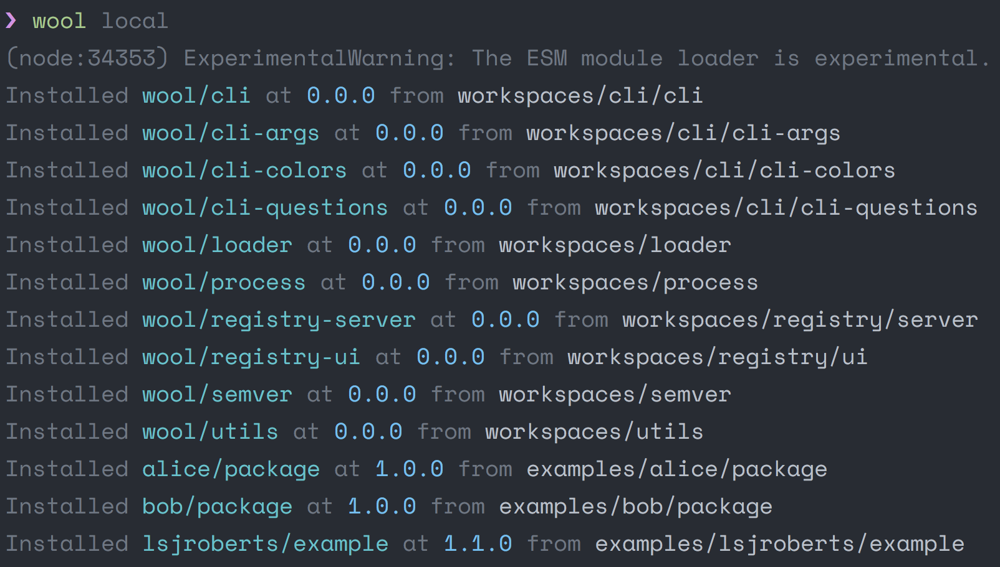
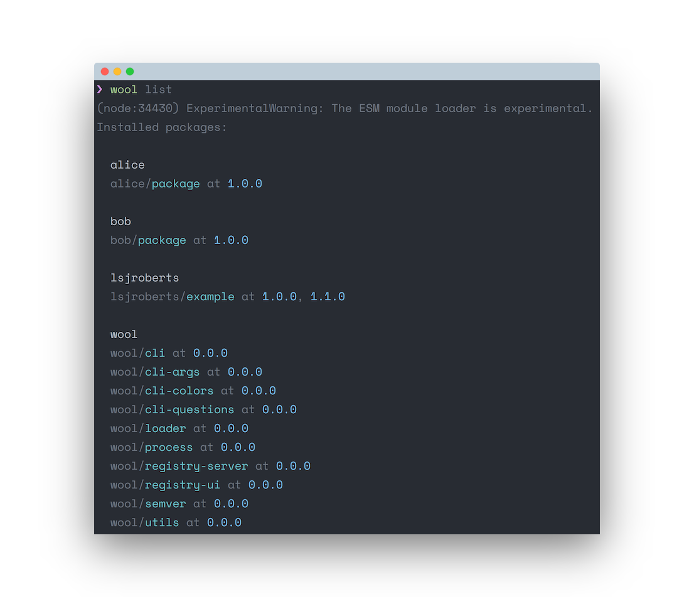

# Wool

See http://gelatindesign.co.uk/coding/javascript-ecosystem

## Getting Started

While in development the installation step is manual.

1.  Clone this repository
2.  Install [node >= 10.5.0](https://nodejs.org/)
3.  Add `export WOOL_PATH=$HOME/.wool` to your profile
4.  Add `PATH="$PATH:$WOOL_PATH/.bin"` to your profile
5.  Run the installation script:

```
./scripts/install.sh
```

To uninstall use:

```
./scripts/uninstall.sh
```

To test it is working, run:

```
wool list --global
```

And you should see a list of the installed `wool/*` packages.

## CLI

Every command has the following options:

- `--help` - Display detailed help on usage (todo)
- `--dry-run` - Disables all side effects and outputs the actions that would have occurred (todo)

**Execute a node file** (✓)

Due to how wool changes the way modules are loaded, node files can not be run with `node` only. Instead the loader must be provided, the simplest shortcut to this is to use wool:

```
wool path/to/file.mjs
```

**Initialise a project** (todo)

```
wool init
```

**Add a dependency** (wip)

```
wool add lsjroberts/package
```

Searches and installs packages, in order until a matching package and version is found:

1.  Offline first, from `~/.wool/packages`
2.  Previously specified registry for the package in `wool.lock`
3.  Registries in order listed in `wool.json`

Use `--offline` to only look for the package in the existing installed packages, skipping steps 2 and 3.

Use `--fresh` to ignore the `wool.lock` and search for the package online in registry order.

**Add a global dependency** (todo)

```
wool add --global lsjroberts/package
```

Installs a package but does not add it to the local project. Its binaries are symlinked from the `~/.wool/.bin` directory.

e.g.

```json
{
  "name": "lsjroberts/package",
  "version": "1.0.0",
  "bin": {
    "example": "./bin/example.sh"
  }
}
```

```
wool add lsjroberts/package --global
```

```
ls ~/.wool/.bin/example
> ~/.wool/.bin/example -> ../packages/lsjroberts/package/1.0.0/bin/example.sh
```

<!-- **Symlink a package to `~/.wool/packages`** (todo)

```
wool link .
``` -->

**Version a package** (wip)

```
wool version [version]
```

If no version is provided, it attempts to detect semantic version changes and suggests a new version.

If it has changed, updates the version in `wool.json`.

**Bundle a package** (todo)

```
wool bundle
wool bundle ~/example.tar.gz
wool bundle --version 1.1.0
```

Versions and zips a package into an installable bundle.

**Publish a package** (todo)

```
wool publish
wool publish --version 1.1.0
```

Bundles the package then publishes it to each listed registry that is compatible.

**Publish a package only locally to the `~/.wool` directory** (wip)

```
wool local?
wool local? --watch
```

Bundles and installs the package into `~/.wool/packages/[namespace]/[package]/[version]`.

Use `--watch` to watch its files and republish after any changes.

It will use the version specified in `wool.json`, overwriting any previously installed instance of the package at that version.

**Execute a script from `wool.json`** (todo)

```
wool run [script]
```

e.g.

```json
{
  "scripts": {
    "start": "wool index.mjs"
  }
}
```

```
wool run start
```

## Example

Within the root directory of this repo:

```
wool local
wool list --global
```

Then execute a script with:

```
wool examples/lsjroberts/example/index.mjs
```

And if it all works you should see the following output:

```
bob/package -- alice/package -- lsjroberts/example
```



