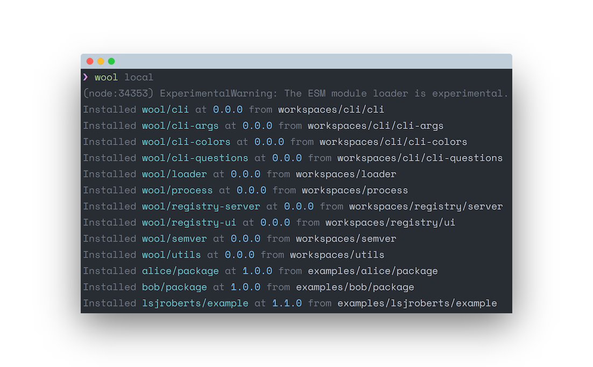

# Wool

See http://gelatindesign.co.uk/coding/javascript-ecosystem

## Getting Started

1.  Install [node >= 10.5.0](https://nodejs.org/)
2.  Add `export WOOL_PATH=$HOME/.wool` to your profile
3.  Add `PATH="$PATH:$WOOL_PATH/.bin"` to your profile
4.  Run the installation script:

```
./scripts/install.sh
```

To uninstall use:

```
./scripts/uninstall.sh
```

To test it is working, run:

```
wool list
```

And you should see a list of the installed `wool/*` packages.

## Example

```
wool local
wool list
wool examples/lsjroberts/example/index.mjs
```

```
bob/package -- alice/package -- lsjroberts/example
```



